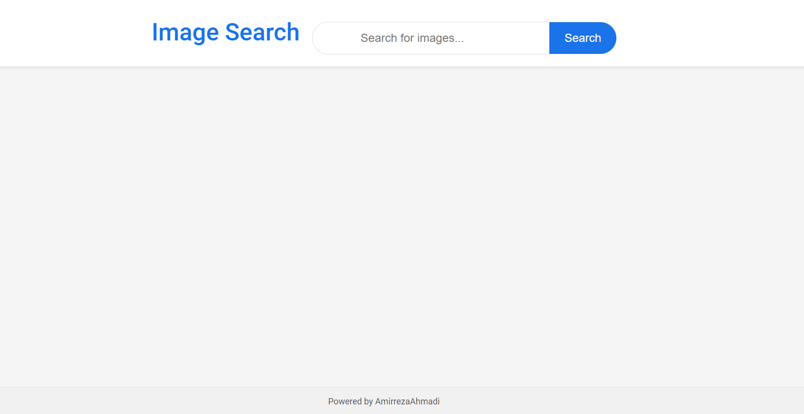
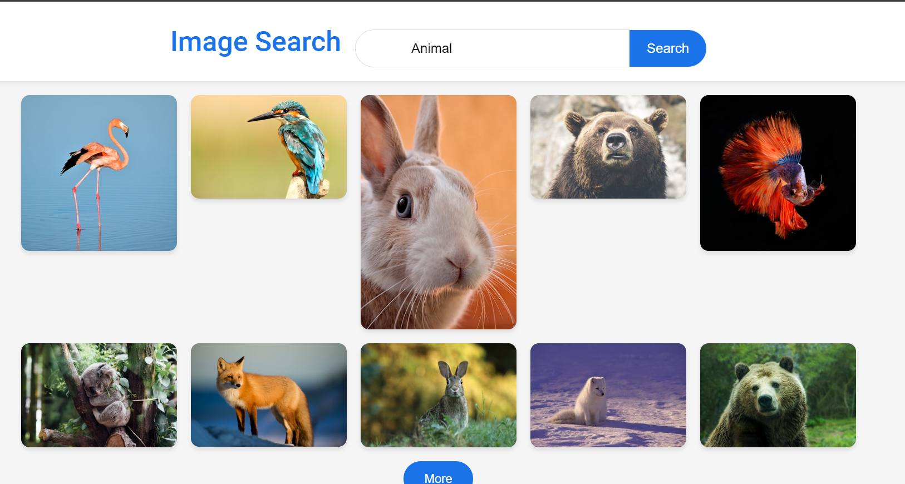

# Image Search Engine Project

This project is a responsive image search engine built with **JavaScript**, **HTML**, and **CSS**. It integrates with the **Unsplash API** to allow users to search for images based on keywords, with support for pagination through a "More" button to load additional results.

## Table of Contents
- [ScreenShot](#screenshot)
- [Features](#features)
- [Built With](#built-with)
- [Prerequisites](#prerequisites)
- [Usage](#usage)
- [Contact](#contact)

## ScreenShot




<p align="right">(<a href="#table-of-contents">back to top</a>)</p>

## Features

- Search for images using keywords powered by Unsplash API.
- Load more results incrementally with a "More" button.
- Responsive and clean user interface with a grid display for images.
- Real-time display of results with easy navigation between image pages.

<p align="right">(<a href="#table-of-contents">back to top</a>)</p>

## Built With

This project was built using the following technologies:

* 
* 
* 

<p align="right">(<a href="#table-of-contents">back to top</a>)</p>

## Prerequisites

To run this project, you need:
- A modern web browser that supports HTML, CSS, and JavaScript.
- An active **Unsplash API key** to enable the image search functionality.

<p align="right">(<a href="#table-of-contents">back to top</a>)</p>

## Usage

1. Clone the project from GitHub or download the files:
   ```bash
   git clone https://github.com/AmirrezaAhmadi/Image-Search-Engine-Vanilla-Js.git

2. Open the Image-Search-Engine.Html file in your browser.

3. Add your Unsplash API key in the config.js file:

```javascript
const CONFIG = {
   apiKey: 'YOUR_UNSPLASH_API_KEY', //Replace Your API KEY
   apiEndpoint: 'https://api.unsplash.com/search/photos',
};
```

<p align="right">(<a href="#table-of-contents">back to top</a>)</p>

## Contact

You can reach me through the following:

* Email: AmirrezaAhmadi.GH@Gmail.com
* Telegram: https://t.me/AmirrezaDevelop
* Instagram: https://www.instagram.com/codewithamirreza
* Project Link: https://github.com/AmirrezaAhmadi/Image-Search-Engine-Vanilla-Js.git

<p align="right">(<a href="#table-of-contents">back to top</a>)</p>